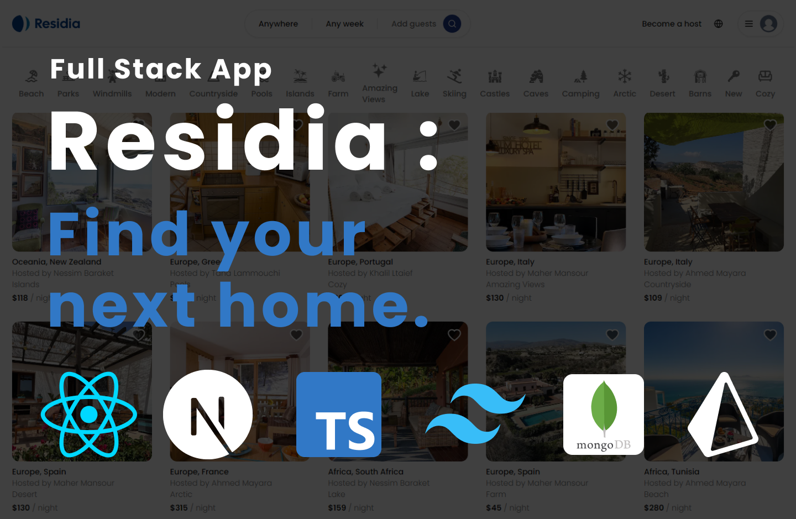

# Full Stack Application with Next.js 14: React, Tailwind, Prisma, MongoDB, NextAuth V5, and more



## Introduction

🏡 Welcome to Residia, your ultimate home-finding companion! 🌟

Residia is a powerful and intuitive application designed to help you discover the perfect home for your needs. Whether you're planning a weekend getaway or a long-term stay, Residia simplifies the process of finding comfortable and tailored accommodations.

## Features

- 🔒 **Authentication**: Sign up and log in to your account to view your bookings and upcoming trips using NextAuth V5.
- 🏠 **Home Search**: Advanced search functionality allows you to filter homes by location, price, and more!
- 📝 **Home Details**: View detailed information about each home, including price, location, and more!
- 📸 **Rich Media**: Explore homes through high-quality images.
- 📅 **Booking and Cancelation**: Book and cancel your reservations with ease.
- 🏡 **Add or delete your properties**: Add your own properties to the platform and manage them with ease.
- ❤️ **Like and save your favorite homes**: Save your favorite homes to your profile for easy access.
- 📱 **Responsive**: Residia is fully responsive and works on all devices!
- ⚡ **Fast**: Residia is built with Next.js, which provides a fast and optimized experience for users.
- 🎨 **Tailwind Design**: Residia is designed with Tailwind CSS, which provides a clean and modern design.
- 📄 **SSR (Server Side Rendering)**: Residia is built with Next.js, which provides SSR out of the box.
- 📦 **MongoDB**: Residia uses MongoDB to store data and provides a clean and intuitive API.
- 📦 **Prisma**: Residia uses Prisma to manage the database and provides a clean and intuitive API.
- 🚀 **Deployment**: Residia is deployed on Vercel and is live at [residia.vercel.app](https://residia.vercel.app/).

## Prerequisites

Node.js version 18.17 or higher is required to run this application.

## Getting Started

### First, clone the repository:

```bash
git clone https://github.com/ahmedmayara/residia-app.git
```

### Then, install the dependencies:

```bash
npm install
```

### Set up your environment variables:

```js
AUTH_SECRET=
DATABASE_URL=
UPLOADTHING_SECRET=
UPLOADTHING_APP_ID=
```

### Set up Prisma:

```bash
npx prisma generate
npx prisma db push
```

### Finally, run the development server:

```bash
npm run dev
```

## Available Commands

| Command       | Description                                      |
| ------------- | ------------------------------------------------ |
| `npm run dev` | Runs the development server on `localhost:3000`. |
